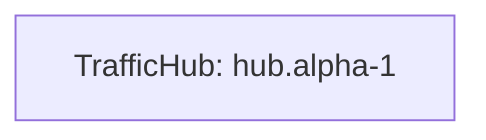

# DARWIN v0.2 Mermaid Visualization

DARWIN can export deterministic Mermaid text diagrams for simulator observability.
This is a plain-text export only: it does not render images, open a browser, mutate
topology, or add runtime networking behavior.

## CLI Usage

```powershell
python -m darwin.cli.main run scenarios/003_lane_open_and_send.yaml --export-mermaid diagram.mmd
```

Optional flags:

- `--no-mermaid-devices` omits attached device leaf nodes.
- `--no-mermaid-lanes` omits logical lane route comments.

Existing JSON exports can be used at the same time:

```powershell
python -m darwin.cli.main run scenarios/003_lane_open_and_send.yaml `
  --export-snapshot snapshot.json `
  --export-events events.json `
  --export-result result.json `
  --export-mermaid diagram.mmd
```

## Python Usage

```python
from darwin.sim.runner import run_scenario
from darwin.sim.visualize import scenario_result_to_mermaid

result = run_scenario("scenarios/003_lane_open_and_send.yaml")
mermaid = scenario_result_to_mermaid(result)
```

## Output Shape

Mermaid exports use `flowchart LR`, include traffic hubs as nodes, include
traffic hub links as undirected edges, and include attached devices as leaf nodes
by default. Logical lanes are exported as deterministic Mermaid comments with
their state, endpoints, route, and route cost when available.

Node IDs are sanitized for Mermaid syntax. Human-readable labels preserve the
original simulator IDs:


